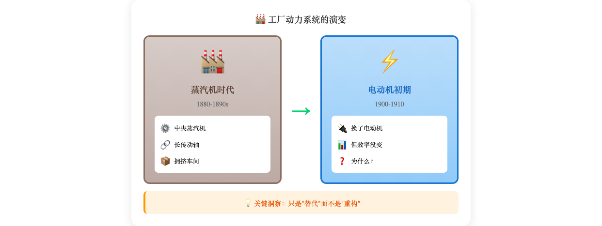
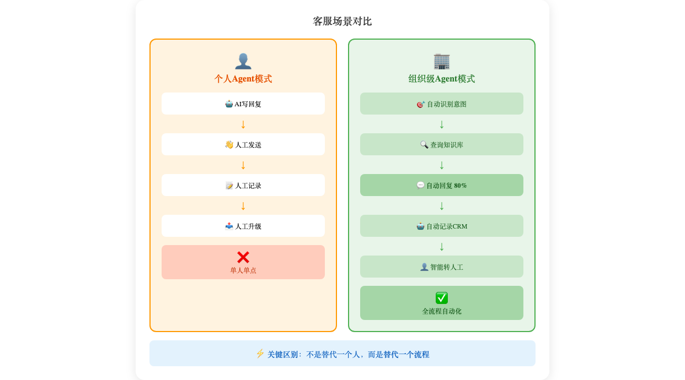
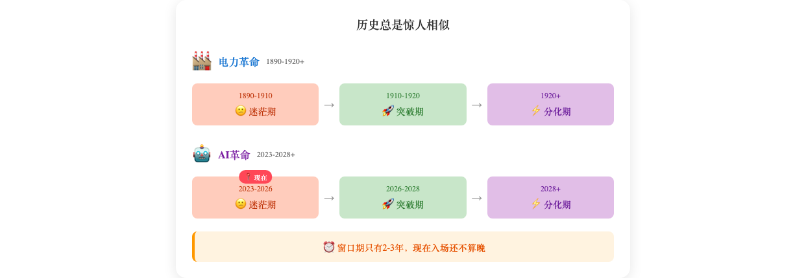

# AI时代的组织机会 - 小红书版（数据核查+出处版）

---

## 🔥 你的团队用了AI，为什么越用越亏？

> 一个反直觉的真相：AI让每个人效率翻倍，但组织的钱却没多赚

---

<!-- 封面图：效率vs利润对比 -->

---

发现了一个诡异的现象👇

AI让每个人效率都翻倍了
但组织的整体产出...居然没变？！

程序员用Copilot写代码快一倍
但项目交付周期还是老样子

分析师用AI做PPT更精美了
决策速度...纹丝不动

**提升的效率去哪了？**😅

答案藏在120年前的历史里。

---

## ⚡ 历史正在重演：电力革命的教训

> 📚 **历史背景**：19世纪末至20世纪初，电力开始取代蒸汽动力成为工厂主要能源，这是人类历史上最重要的技术变革之一。

这不是第一次发生。

### 电动机的尴尬期（1890-1910）

1890年代，美国工厂大规模电气化。
电动机比蒸汽机先进多了——更清洁、更安全、更易于控制。

工厂纷纷换掉蒸汽机，投入巨大。

**结果？生产率提升微乎其微**😰

为什么？

因为他们只是把电动机放在原来蒸汽机的位置：
- 生产线没变
- 布局没变  
- 流程没变

**电动机的好处，全被旧设计吃掉了**💸

> 📖 **出处说明**：这一时期被称为"电力悖论"（The Electricity Paradox）。经济学家Paul David在研究中发现，工厂电气化后30年内，全美制造业生产率几乎没有增长。参见：David, P. A. (1990). "The Dynamo and the Computer: An Historical Perspective on the Modern Productivity Paradox." *American Economic Review*.

---

<!-- 配图2：蒸汽机vs电动机对比 -->

---

## 🚀 真正的转折点：福特的流水线革命

> 📚 **历史背景**：亨利·福特（Henry Ford）于1903年创立福特汽车公司，1913年在 Highland Park 工厂引入移动装配线，彻底改变了制造业。

1913年，福特干了件大事。

他没只换电机，而是**围绕电机重新设计了整个工厂**：

- 集中式动力 → 每个工位独立电机
- 长传动轴 → 流水线布局

**结果有多猛？**

<!-- 配图3：福特流水线成果 -->

Model T底盘装配时间从**12小时降至93分钟**。

汽车价格从**$850降至$260-300**（1925年数据）。

> 📖 **数据出处**：
> - 生产时间数据：Ford Motor Company 官方历史记录，引自 Ford, H. (1922). *My Life and Work*.
> - 价格数据：1908年Model T初始售价$850；1925年通过流水线优化降至$260。参见：Hounshell, D. A. (1984). *From the American System to Mass Production, 1800-1932*. Johns Hopkins University Press.
> - 流水线引入时间：1913年10月7日，Highland Park工厂首次测试移动装配线。参见：Ford Motor Company Archives.

**不是电动机创造了价值，是围绕电动机重新设计的生产系统创造了价值**✨

---

## 🤖 现在AI正处在"电动机初期"

惊人的相似👇

| 电动机初期 | AI初期 |
|-----------|--------|
| 技术更先进 | 技术更先进 |
| 单点效率提升 | 个人效率翻倍 |
| 整体产出没变 | 整体产出没变 |

现在的典型做法：
- 用AI写原来人写的文档 ✓
- 用AI做原来人做的分析 ✓
- **但流程没变、协作没变、组织结构没变** ✗

AI成了"更快的打字机"
而不是"新的生产方式"💭

---

## 💡 真正的机会：组织级Agent

不是"每个人用自己的ChatGPT"

而是👇
**一个嵌入组织流程的AI系统**
**理解组织目标、协调多人协作、自主完成跨环节任务**

举个例子🌰

---

<!-- 配图4：个人Agent vs 组织级Agent 对比 -->

**客服场景对比：**

个人Agent模式：
客服用AI写回复 → 人工发送 → 人工记录 → 人工升级

组织级Agent模式：
自动识别客户意图 → 查询知识库 → 自动回复(80%问题)
→ 自动记录CRM → 复杂问题自动转人工+预填工单
→ 事后自动分析满意度

**关键区别：不是替代一个人，而是替代一个流程**⚡

---

## ⏰ 窗口期只有2-3年

> 📚 **参考框架**：技术革命的历史周期研究，参考Carlota Perez的技术-经济范式理论。

电力革命 timeline：
- 1890-1910：迷茫期（技术采用但生产力停滞）
- 1910-1920：突破期（新生产组织方式出现）
- 1920后：分化期（适应的崛起，不适应的淘汰）

AI革命节奏更快：
- 2023-2026：迷茫期（就是现在）
- 2026-2028：突破期（组织级Agent出现）
- 2028后：分化期

> 📖 **理论参考**：Carlota Perez在《技术革命与金融资本》中提出，每次技术革命都经历"导入期-展开期"两阶段，中间存在"转折点"。AI革命可能正处在这个转折点。参见：Perez, C. (2002). *Technological Revolutions and Financial Capital*. Edward Elgar Publishing.

**结论：现在入场，还不算晚**
**再拖2-3年，可能就没你位置了**👀

---

<!-- 配图5：双时间线对比 -->

---

## ✅ 3个可执行动作（建议收藏）

---

<!-- 配图6：3步行动清单 -->

---

**动作1：识别"全流程AI化"场景**
找涉及3个以上环节、多人协作、规则明确的工作
比如：客户投诉处理、销售线索跟进、内容发布流程

**动作2：试点1个组织级Agent（1-3个月）**
拆解现有流程 → 设计AI介入点 → 用低代码工具搭MVP → 跑起来迭代
工具推荐：Dify、Coze、Make、n8n

**动作3：积累组织知识资产**
客户沟通话术、内部决策规则、行业know-how、历史案例库
现在开始文档化，为训练专有Agent做准备📚

---

## 🎯 一句话总结

个人用AI提效只是开始
**组织级Agent才是主战场**

历史告诉我们：
技术革命的真正赢家
不是最早用新工具的人
而是最早**围绕新工具重新设计系统**的人

---

<!-- 配图7：金句海报 -->

---

💬 **互动时间：**
你们公司现在用AI到什么程度了？
是"更快的打字机"还是已经在重构流程了？
评论区聊聊👇

---

`#AI #组织管理 #职场干货 #效率工具 #创业思维 #企业管理 #Agent #人工智能`

---

## 📚 参考资料

| 出处 | 作者/机构 | 内容 |
|------|----------|------|
| *My Life and Work* (1922) | Henry Ford | 福特流水线生产数据 |
| *From the American System to Mass Production* (1984) | David A. Hounshell | 美国制造业史 |
| "The Dynamo and the Computer" (1990) | Paul A. David | 电力革命与生产力悖论 |
| *Technological Revolutions and Financial Capital* (2002) | Carlota Perez | 技术革命周期理论 |
| Ford Motor Company Archives | 福特汽车官方档案 | 流水线引入时间记录 |

---

*优化版本：v2.0（数据核查+出处标注版）*
*修订日期：2026-04-09*
