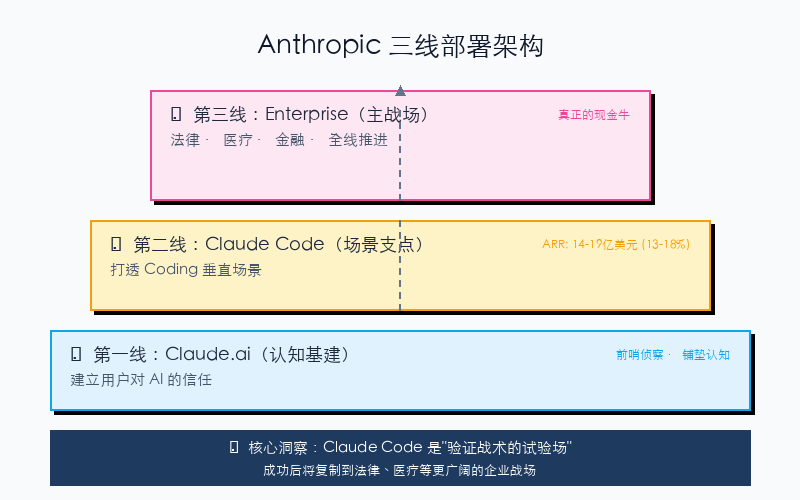
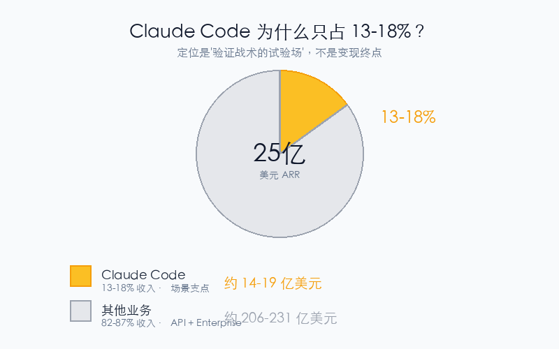

# Claude 年入 25 亿的秘密：为什么最火的 Code 只占 13% 收入？

2026年2月，一个数字让硅谷震动：**Claude Code 的年收入（ARR）突破 25 亿美元**。

从0到10亿，只用了6个月——这比 ChatGPT 早期增速还快。

但这里有个反直觉的细节：**这25亿，只占 Anthropic 总收入的约 13-18%**。

为什么 Anthropic 最锋利的尖刀，却不是最重的火力？

**答案藏在它的"三线部署"里。**

---

## 一、三线部署：一张图说清

**第一线：Claude.ai（认知基建）**
- 作用：让用户体验 AI 能力，建立信任
- 就像超市试吃——先尝后买

**第二线：Claude Code（场景支点）**
- 作用：打透 Coding 这个垂直场景
- 年收入：约 14-19 亿美元（13-18%）
- 定位：**验证战术的试验场**，不是变现终点

**第三线：Enterprise（主战场）**
- 作用：向法律、医疗、金融等高价值行业推进
- 这才是真正的"现金牛"

---

## 二、为什么是 Coding 先跑通？

| 场景 | AI 适配度 | 为什么 |
|------|-----------|--------|
| **Coding** | ⭐⭐⭐⭐⭐ | 结构化、有明确对错、工具链成熟 |
| **法律服务** | ⭐⭐⭐⭐ | 文档处理、高毛利、强合规 |
| **医疗健康** | ⭐⭐⭐ | 专业壁垒高、数据敏感 |

Coding 是 AI Agent 的"低垂果实"：
- GitHub 上 **4% 的公开代码提交**作者是 Claude Code
- 预计 2026 年底达到 **20%+**

更重要的是：**软件工程是科技行业的基础设施**。这里被攻克，整个软件板块估值逻辑都要重写。

---

## 三、Claude Code 为什么"好用却不赚钱"？

因为它从一开始就不是为了"赚钱"设计的。

**它的真正价值**：
1. **验证 Agent 战术**在 coding 场景的可行性
2. **建立锁定效应**——团队把代码库绑在 Claude 上，迁移成本极高
3. **复制经验**到法律、医疗等更广阔的战场

这就是"三线部署"的本质：**用 coding 阵地验证战术，再向纵深推进。**

---

## 四、华尔街为什么慌了？

2026年2月，Claude 发布三款金融 Plugin，直接引发软件股抛售潮——**2850 亿美元市值蒸发**。

**被冲击的软件公司**：

| 公司 | 产品 | 被替代风险 |
|------|------|------------|
| Intuit | TurboTax | 税务评估自动化 |
| Oracle | 财务系统 | 企业财务分析 |
| Bloomberg | Terminal | 金融数据分析 |

**逻辑很简单**：如果 AI 能攻破高毛利、高壁垒的法律/医疗行业，其他行业就更不用说了。

---

## 五、三条可执行动作

1. **如果你是开发者**：试用 Claude Code，体验什么是"Agent 级"编程助手（官网免费试用）

2. **如果你是管理者**：观察团队工作流，哪些重复性文档工作可能被 AI 替代？

3. **如果你是投资者**：关注法律、医疗信息化板块的财报，看它们如何应对 AI 冲击

---

## 六、互动时间

**你觉得 AI 会先替代哪个行业？**
- A. 法律服务（合同审查、法律检索）
- B. 医疗健康（病历记录、临床决策）
- C. 其他（评论区说说）

👇 **评论区聊聊** 👇

**觉得有启发？转发给关注 AI 趋势的朋友** 🚀

---

*参考资料：SemiAnalysis《Claude Code is the Inflection Point》、Anthropic Economic Index 2025-2026、Stormy AI、WIRED、Bloomberg*
